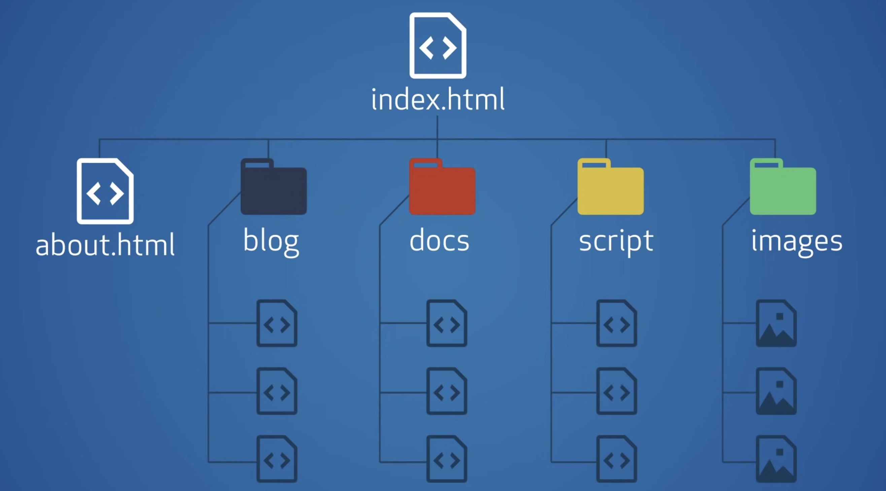

<!-- _class: big -->

# SchiWe Ostern 2022
# <!--fit--> Github Pages

---

<!-- _class: big -->

# Agenda

  Was sind Github Pages?

 Was sind Github Pages **<u>nicht</u>**?

:hammer: Wie erstelle ich eine Github Page?

:superhero_woman: Github Workflow und Actions

:film_projector: Kurze Vorstellung Modulewebseite Prototyp

---

# <!--fit-->  Was sind Github Pages?



:rock: **Statische** HTML Seite

- Befinden sich in einem **Git Repo auf Github**
- Github stellt eine URL zur verfügung, welche auf das **index.html** zeigt
- **Web 1.0 reloaded! :cowboy_hat_face:**

:tv: https://account-name.github.io
:link: https://pages.github.com

---

#  Was sind Github Pages **<u>nicht</u>**?

- Kein _richtiger_ Webserver
  - "nur" ein URL Dateizugriff direkt auf das Repository
- `.htaccess`, `modrewrite` und co. gehen zum Beispiel nicht
- Es existiert **kein Schutz** von Ordnern
- Es kann auch **kein backend `Code`** ausgeführt werden 

> :information_source: Für **bezahlte Accounts** können **geschützte Pages** auf private Repos erstellt werden. Die sind dann aber **nur ganz privat**. 
>
>
> :bulb: `PHP`, `Python`, `Ruby` und co. **gehen nicht**

---

# :hammer: Wie erstelle ich eine Github Page?

1. Erstelle ein Git Repository auf Github 

2. Erstelle eine `index.html` Datei mit beliebigem Inhalt _(am besten HTML :star_struck:)_
3. Gehe auf `Settings` > `Pages` **des Repositories** auf Github
4. Wähle einen `Branch` und der `Pfad` 
5. Gehe auf https://dein-benutzername.github.io/**repository-name**[/Pfad]

> :bulb: Auf https://pages.github.com gibt es eine Anleitung. Diese setzt ein Repo voraus, welches genau so heisst wie der Domain (dein-benutzername.github.io). Mit **Punkt 3. und 4.** kann man eine **Page aus einem beliebigen Repo** manchen.

---

# :superhero_woman: Github Workflow und Actions
:link: https://docs.github.com/en/actions/learn-github-actions

- Befinden sich im Ordner `.github/workflows` im Repository root
- Meistens in Form einer `.yml` Datei z.B `main.yml`

```yaml
name: learn-github-actions
on: [push]
jobs:
  check-bats-version:
    runs-on: ubuntu-latest
    steps:
      - uses: actions/checkout@v3 # Können auch eigene Actions sein!
      - uses: actions/setup-node@v3
        with:
          node-version: '14'
      - run: npm install -g bats
      - run: bats -v
```

---

# :superhero_woman: Github Workflow und Actions

- Es können **automatisch Aktionen** ausgeführt werden
  - z.B. immer wenn ein `git push` ausgeführt wird!
- Github Actions können selber geschreiben werden
- Github Actions können wiederum eigene Docker Images verwenden
- So kann man z.B. aus `.md` Dateien `.html` Dateien generieren
  - Dazu gibt es [vuepress](https://vuepress.vuejs.org/), [astro](https://astro.build/), [jekyll](https://jekyllrb.com/), [GatsbyJS](https://www.gatsbyjs.com/) und noch viele mehr.

> :speech_balloon: Ich <u>versuche</u> momentan eine generische **Github Action für Modulewebseiten** zu erstellen!

---

# :film_projector: Kurze Vorstellung Modulewebseite Prototyp

